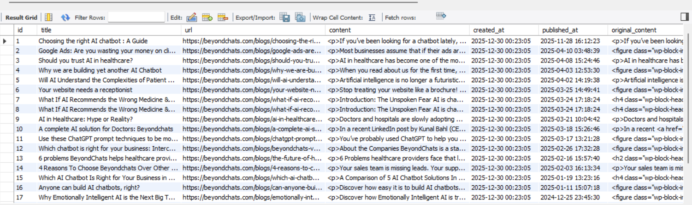
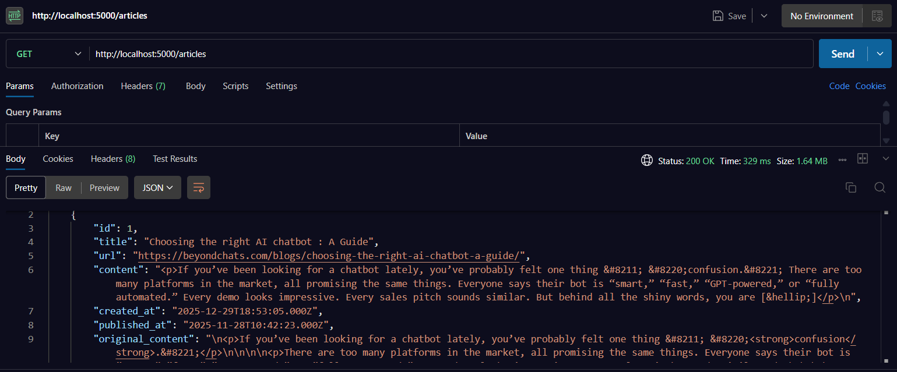
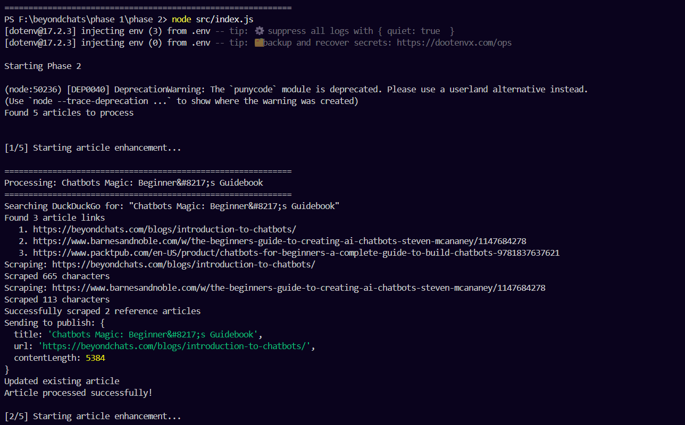
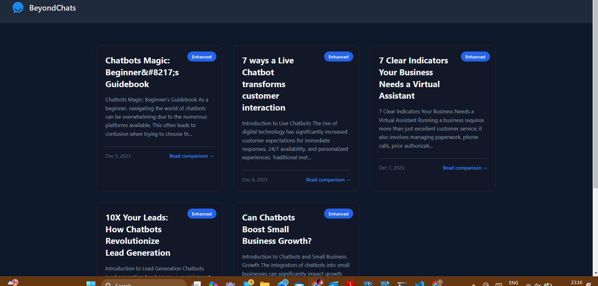
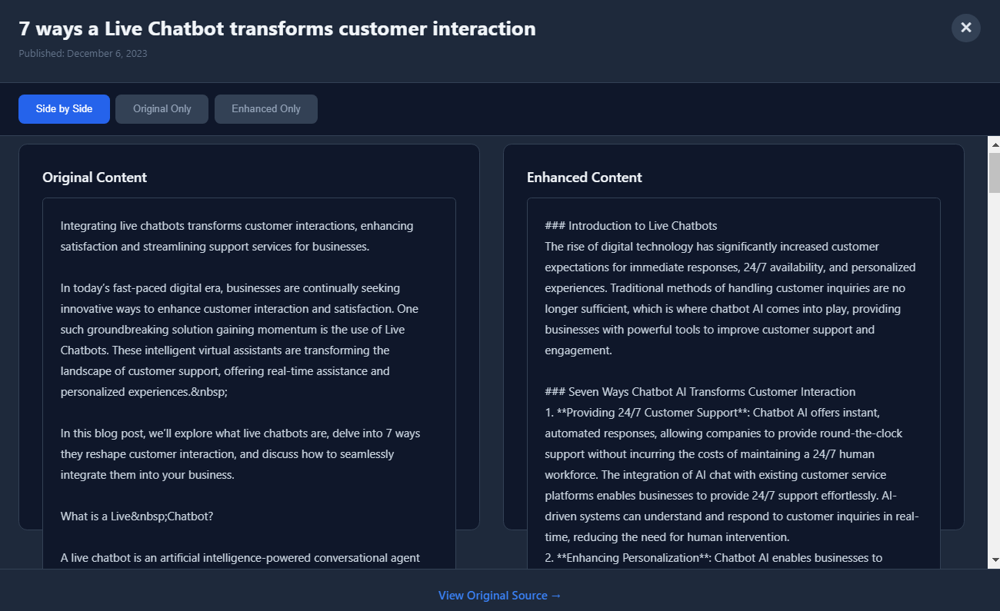

# BeyondChats – AI Article Enhancement Pipeline

## Live Deployment  
**Frontend:** [Live Frontend Deployment](https://beyondchats-drishti-p1ca.vercel.app/)  
**Backend API:** [Live Backend Deployment](https://beyondchats-api-bt3m.onrender.com/)

 

## Overview

This project implements a three-phase AI-driven content processing workflow developed as part of the BeyondChats technical assignment. The system ingests live blog content from the BeyondChats WordPress REST API, enhances it using AI with supporting web references, stores both versions securely, and provides a dashboard interface for review.

The architecture intentionally separates ingestion, processing, and presentation to ensure maintainability, traceability, and production-style reliability.

 

## System Capabilities

- Fetches real BeyondChats blog articles using the WordPress REST API  
- Stores original content in a MySQL database  
- Searches for related external references using DuckDuckGo  
- Extracts readable content using Cheerio  
- Generates AI-enhanced versions using the Groq LLM API  
- Preserves the source text without modification  
- Displays original and rewritten content in a React dashboard  

 

## Architecture

```
BeyondChats WordPress REST API
        ↓
Phase-1 — Backend API (Node.js + Express + MySQL)
        ↓
Database
(original_content + rewritten_content)
        ↓
Phase-2 — AI Rewrite Engine (Node.js script)
        ↓
Database (rewritten_content updated)
        ↓
Phase-3 — React Frontend Dashboard
```

### Key Principles
- Original content is never overwritten  
- AI-generated output is stored separately  
- Each phase operates independently and can be tested in isolation  

 

## Repository Structure

```
phase-1/   Backend API + WordPress ingestion
phase-2/   AI Rewrite Automation Script
phase-3/   React Frontend Dashboard
```

### Detailed Layout

```
phase-1/
├─ src/
│  ├─ routes/articles.js
│  ├─ app.js
│  └─ db.js
├─ db.sql
└─ .env

phase-2/
├─ src/
│  ├─ index.js
│  ├─ google.js
│  ├─ scrape.js
│  ├─ rewrite.js
│  └─ publish.js
└─ .env

phase-3/
├─ public/
├─ src/
│  ├─ App.js
│  ├─ App.css
│  └─ index.js
└─ .env
```

 

## Phase Details

### Phase-1 — Backend API and Article Ingestion

This service is responsible for:

- Fetching live articles from the official BeyondChats WordPress REST API  
  https://beyondchats.com/wp-json/wp/v2/posts  
- Persisting article data in MySQL  
- Enforcing uniqueness by URL  
- Storing  
  - `original_content`  
  - `rewritten_content` (initially NULL)  
- Providing REST API support for  
  - Phase-2 automation  
  - Phase-3 frontend  

**API Response Example**



**Postman Example**



 

### Phase-2 — AI Enhancement Engine

This Node.js script automates rewriting workflows:

- Retrieves the oldest article without rewritten content  
- Uses DuckDuckGo HTML search results  
- Extracts readable reference text via Cheerio  
- Generates improved article content using the Groq LLM API  
- Appends a reference section from collected sources  
- Updates only the `rewritten_content` column  
- Ensures original data remains unchanged  

**Terminal Logs**



 

### Phase-3 — React Dashboard UI

The frontend provides a simple dashboard for article review.

Features include:

- Article listing  
- Source link access  
- Modal content viewer  
- Side-by-side comparison of  
  - Original content  
  - Rewritten content  
- Minimal, distraction-free styling  

**Dashboard Home**



**Comparison View**



 

## Technology Stack

### Backend
- Node.js  
- Express.js  
- MySQL  
- Axios  
- Cheerio  
- WordPress REST API  

### AI Layer
- Groq LLM API  

### Search
- DuckDuckGo HTML results  

### Frontend
- React (Create-React-App)  
- CSS  

 

## Local Development Setup

### 1. Clone Repository
```bash
git clone <REPO_LINK_HERE>
cd beyondchatsDrishti
```

### 2. Phase-1 Backend Setup
```bash
cd phase-1
npm install
```

Create `.env`:
```
DB_HOST=localhost
DB_USER=root
DB_PASSWORD=****
DB_NAME=beyondchats
DB_PORT=3306
PORT=5000
```

Start server:
```bash
node src/app.js
```

Base URL:
```
http://localhost:5000
```

Trigger ingestion:
```
GET /articles/scrape
```

### 3. Phase-2 AI Pipeline
```bash
cd phase-2
npm install
```

Create `.env`:
```
GROQ_API_KEY=
API_BASE=http://localhost:5000
```

Run:
```bash
node src/index.js
```

### 4. Phase-3 Frontend
```bash
cd phase-3
npm install
npm start
```

Access via:
```
http://localhost:3000
```


## API Routes

| Method | Endpoint              | Description        |
|  -|        |      --|
| GET   | /articles              | Fetch all          |
| GET   | /articles/oldest       | Fetch first five   |
| GET   | /articles/:id          | Fetch by ID        |
| POST  | /articles              | Insert rewritten   |
| PUT   | /articles/by-url       | Update by URL      |
| DELETE| /articles/:id          | Remove             |


## Status

- All three phases implemented  
- End-to-end pipeline functional  
- Original content preserved  
- AI rewriting operational  

